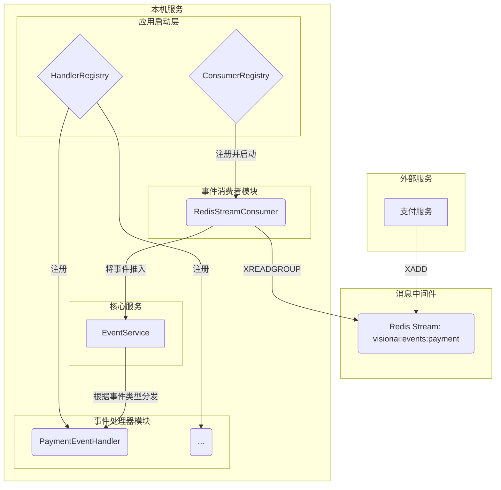

# 支付事件处理系统设计文档

## 1. 概述

本文档旨在设计一套可靠、可维护且高度可扩展的系统，用于处理来自外部**支付服务**的事件，并根据这些事件为用户发放相应的积分（Credits）。

该设计遵循**可插拔数据源**的原则，将事件处理流程分解为两层独立的、可注册的模块：

1.  **事件消费者 (`Consumer`)**: 负责从外部数据源（如 Redis, Kafka）**拉取**事件。
2.  **事件处理器 (`Handler`)**: 负责对事件执行具体的**业务逻辑**。

## 2. 整体架构

系统架构围绕 `EventService` 展开，但 `EventService` 本身不关心事件的来源。



## 3. 核心设计：可插拔的消费者层

我们在 `internal/service/event/` 目录下创建 `consumer/` 子目录，用于实现所有消费者逻辑。

### 3.1. `Consumer` 接口

在 `consumer/interface.go` 中，我们定义一个通用的 `Consumer` 接口。任何外部事件源的接入，都只需要实现此接口。

```go
package consumer

type Consumer interface {
    Start()
    Stop()
    SourceName() string
}
```

同时，我们提供一个 `Registry` 来统一管理和生命周期（启动/停止）所有已注册的 `Consumer` 实例。

### 3.2. `RedisStreamConsumer` 实现

作为第一个具体实现，`consumer/redis_stream.go` 定义了 `RedisStreamConsumer`。

- **职责**: 实现了 `Consumer` 接口。其 `Start` 方法会启动一个 goroutine，在循环中通过消费者组模式 (`XREADGROUP`) 从 Redis Stream 中拉取支付事件。
- **数据流**: 拉取到消息后，它会解析数据并构造成 `model.UserEvent` 对象，然后调用 `eventService.HandleBackgroundEvent` 方法，将事件"喂"给核心的 `EventService` 进行处理。

## 4. 核心设计：可插拔的处理器层

我们复用项目现有的 `Handler` 注册机制，创建一个新的 `PaymentEventHandler`。

### 4.1. `PaymentEventHandler` 实现

在 `internal/service/event/handlers/` 目录下创建 `payment_handler.go`。

- **职责**: 实现了 `event.Handler` 接口，并注册自己能处理的事件类型（`subscription.created`, `onetime.purchase` 等）。
- **数据流**: 当 `EventService` 从 `eventChan` 中拿到一个支付事件并分发给它时，`HandleEvent` 方法会被调用。它会解析事件的 `EventData`，并调用 `credit.Service` 或 `credit.MembershipService` 来完成最终的积分发放。

### 4.2. 事件消息规范 (v2)

为了提升系统的可扩展性和可维护性，我们重新设计了支付事件的消息载体。新的设计将业务决策所需的所有信息都包含在事件本身中，使得事件处理器（`PaymentEventHandler`）的职责更加单一和清晰。

支付服务需要向 Redis Stream 中写入符合特定格式的消息。消息本身是一个 JSON 字符串，可以被解析为 `model.UserEvent`。其 `EventData` 字段又是一个内嵌的 JSON 字符串，其结构 (`PaymentPayload`) 如下：

#### 推荐的 `PaymentPayload` 结构

```json
{
  "project_id": "com.visionai.app.ios",
  "order_id": "ord_GHIjkl67890",
  "credit_details": {
    "type": "membership_grant", 
    "transaction_type": "subscription_created",
    "amount": 500,
    "expires_at": "2025-07-28T10:00:00Z",
    "description": "月度会员 - 赠送500点"
  },
  "subscription_details": {
    "level": 2,
    "expires_at": "2025-07-28T10:00:00Z"
  }
}
```

#### 字段详细说明

*   `project_id` (string): 项目唯一标识符。
*   `order_id` (string): 支付订单号，用作交易溯源的唯一ID (`SourceID`)。
*   **`credit_details` (object, 必填)**: 描述本次额度变更的核心对象。其字段设计与 `credit.Service.AddCredits` 方法参数对齐。
    *   `type` (string): **额度类型**。明确额度的性质。例如：`purchased` (购买所得), `membership_grant` (会员赠送), `promo` (活动赠送)等。 **此字段是解决额度来源问题的关键**。
    *   `transaction_type` (string): **交易类型**。用于清晰地分类交易历史记录。例如：`onetime_purchase` (一次性购买), `subscription_created` (订阅创建), `subscription_renewed` (订阅续费), `refund` (退款)等。
    *   `amount` (int64): **额度数量**。
    *   `expires_at` (string, ISO 8601): **额度过期时间**。如果为 `null` 或空字符串，则代表永不过期。
    *   `description` (string): **交易描述**。用于在用户端App或后台管理界面展示，例如 "月度会员订阅" 或 "购买 1000 点数包"。
*   **`subscription_details` (object, 可选)**: 描述会员资格变更的可选对象。仅当事件涉及会员状态变更时需要提供。
    *   `level` (int): 新的会员等级。
    *   `expires_at` (string, ISO 8601): 会员资格的到期时间。

#### 设计优势

1.  **职责清晰，高度解耦**: 事件源（支付服务）负责定义交易的完整属性，而事件处理器 (`PaymentEventHandler`) 只需忠实地解析数据并调用下游服务即可，移除了硬编码和复杂的 `switch` 判断，代码更稳定。
2.  **通用性与扩展性强**: 当未来新增产品（如 "年度会员包"、"节日促销"）时，只要上游服务能生成符合此规范的事件，**后端代码无需任何修改**即可支持新业务，大大提升了迭代效率。

## 5. 整合与启动流程

应用的启动层（`cmd/main.go`）将负责装配整个流程：

1.  初始化所有服务实例（`redisClient`, `eventService`, `creditService` 等）。
2.  创建 `consumer.Registry` 和 `event.Registry`。
3.  **注册消费者**: 实例化 `RedisStreamConsumer` 并注册到 `consumer.Registry`。
4.  **注册处理器**: 实例化 `PaymentEventHandler`（以及所有其他处理器）并注册到 `event.Registry`。
5.  **启动消费者**: 调用 `consumerRegistry.StartAll()`，一键启动所有后台事件监听。
6.  启动 API 服务器。

## 6. 可靠性与扩展性

- **可靠性**:
  - **持久化**: Redis Stream 保证了事件在服务宕机时不会丢失。
  - **失败重试**: 通过消费者组和 ACK 机制，实现失败事件的自动重试。
  - **死信队列**: 需要额外的监控任务来处理长时间未被 ACK 的消息。
- **扩展性**:
  - **新增事件源**: 只需在 `consumer/` 目录下新增一个 `Consumer` 实现并注册即可。
  - **新增事件类型**: 只需新增一个 `Handler` 实现并注册即可。
  
该双层注册表和可插拔的设计，为系统提供了极高的灵活性和可维护性。

---

## 7. 实施计划 (Implementation Plan)

本章节将跟踪此设计的代码实现进度。

- [x] **1. 定义常量 (Constants Definition)**
    - 在 `internal/constants/` 目录下，为新的支付事件、积分类型和交易类型添加常量定义。

- [x] **2. 扩展 `EventService`**
    - 为 `event.EventService` 结构体增加 `HandleBackgroundEvent(ctx context.Context, event *model.UserEvent) error` 方法，作为后台事件的统一入口。

- [x] **3. 实现 `PaymentEventHandler`**
    - 在 `internal/service/event/handlers/` 目录下创建新文件 `payment_handler.go`。
    - 在文件中定义 `PaymentPayload` 结构体。
    - 创建 `PaymentEventHandler` 结构体，并实现 `event.Handler` 接口 (`EventType()` 和 `HandleEvent()`)。
    - 在 `HandleEvent` 中实现对不同支付事件类型的 `switch` 分发逻辑。

- [x] **4. 实现消费者框架 (Consumer Framework)**
    - 在 `internal/service/event/` 目录下创建 `consumer/` 子目录。
    - 在 `consumer/` 中创建 `interface.go`，定义 `Consumer` 接口和 `Registry` 结构体。

- [x] **5. 实现 `RedisStreamConsumer`**
    - 在 `consumer/` 目录下创建 `redis_stream.go`。
    - 定义 `RedisStreamConsumer` 结构体，并使其实现 `Consumer` 接口。
    - 实现核心的 `run()` 和 `processMessage()` 逻辑，用于从 Redis Stream 拉取、解析和分发消息。

- [x] **6. 整合与装配 (Integration & Wiring)**
    - 在 `internal/bootstrap/service_provider.go`（或类似的文件）中：
        - 实例化 `PaymentEventHandler`。
        - 将新的 handler 注册到 `event.Registry`。
        - 实例化 `consumer.Registry`。
        - 实例化 `RedisStreamConsumer`。
        - 将新的 consumer 注册到 `consumer.Registry`。
    - 在 `cmd/main.go` 中：
        - 在应用启动时调用 `consumerRegistry.StartAll()`。
        - （可选）在应用关闭时调用 `consumerRegistry.StopAll()`。 

---

## 8. 第二阶段实施计划 (Phase 2 Implementation Plan)

本章节旨在跟踪和记录 V2 版本事件消息规范的落地过程。

- [x] **1. 更新 `PaymentPayload` 结构体**
    - 在 `internal/service/event/handlers/payment_handler.go` 中，根据新的 JSON 规范，更新 `PaymentPayload` 的 Go 结构体定义，包含 `CreditDetails` 和 `SubscriptionDetails` 子结构体。

- [x] **2. 重构 `PaymentEventHandler` (V2 - 简洁版)**
    - **核心思想**: `PaymentEventHandler` 的职责被严格限定为**只管理积分**。它不再关心会员状态的变更，`SubscriptionDetails` 字段将被忽略。
    - 简化 `HandleEvent` 方法，使其成为一个纯粹的"记账员"。
    - **`HandleEvent` 的新逻辑**:
        - 解析 `PaymentPayload`。
        - **唯一职责**: 使用 `payload.CreditDetails` 中的信息直接调用 `creditService.AddCredits` 方法，完成积分发放。
        - 移除所有与 `SubscriptionDetails` 相关的逻辑和对 `membershipService` 的依赖。
    - **代码示例**:
      ```go
      // in: internal/service/event/handlers/payment_handler.go
      func (h *PaymentEventHandler) HandleEvent(ctx context.Context, event *model.UserEvent) error {
          var payload PaymentPayload
          if err := json.Unmarshal(event.EventData, &payload); err != nil {
              return errors.Wrap(err, "failed to unmarshal payment event data")
          }

          // 新的核心逻辑: 直接、无条件地使用 CreditDetails 调用 CreditService。
          // 不再关心 SubscriptionDetails 或其他任何与会员状态相关的信息。
          creditInfo := payload.CreditDetails

          // 基础验证
          if creditInfo.Amount == 0 { return nil } // 0额度操作直接忽略
          if creditInfo.Type == "" || creditInfo.TransactionType == "" {
              return errors.New("credit type and transaction type must be specified")
          }
          if payload.OrderID == "" {
              return errors.New("order_id is required for transaction tracking")
          }

          return h.creditService.AddCredits(
              ctx,
              payload.ProjectID,
              event.UserID,
              payload.OrderID,
              constants.CreditType(creditInfo.Type),
              constants.CreditTransactionType(creditInfo.TransactionType),
              creditInfo.Amount,
              creditInfo.ExpiresAt,
              creditInfo.Description,
          )
      }
      ```

- [x] **3. 更新相关常量**
    - 检查 `internal/constants/` 目录，为 `credit_details.type` 和 `credit_details.transaction_type` 可能使用到的新字符串值（如 `membership_grant`, `onetime_purchase`）添加常量定义，以避免在代码中使用魔法字符串。

- [ ] **4. 协调上游服务**
    - (外部依赖) 与负责支付服务的团队沟通，确保 `paylinker` 等上游服务能够按照新的 `PaymentPayload` 格式生成和发送事件到 Redis Stream。重点是 `CreditDetails` 必须被准确填充。 

---

## 9. picflow会员升级特殊逻辑实施计划 (Picflow Membership Upgrade Logic Implementation Plan)

本章节旨在跟踪和记录 `picflow` 项目会员升级时，积分有效期自动延长功能的开发过程。

- [x] **1. 定义 DAO 层接口 (`CreditDaoInterface`)**
    - **文件**: `internal/dao/credit.go`
    - **操作**: 在 `CreditDaoInterface` 接口中，新增一个方法定义 `ExtendActiveGiftCredits(ctx context.Context, tx *gorm.DB, userID string, newExpiresAt time.Time) error`。
    - **目的**: 声明一个用于延长指定用户所有有效赠送积分（`membership_grant` 类型）到期时间的方法。该方法接受一个 `*gorm.DB` 事务对象作为参数，以确保能被包含在更大的业务事务中。

- [x] **2. 实现 DAO 层方法 (`CreditDao`)**
    - **文件**: `internal/dao/credit.go`
    - **操作**: 在 `creditDao` 结构体上，实现 `ExtendActiveGiftCredits` 方法。
    - **实现细节**:
        - 使用 `tx.Model(&model.UserAmount{})` 开始一个事务性查询。
        - 查询条件: `user_id = ?`, `amount_iden IN (?)`, `remaining_amount > 0`。
        - 更新操作: `Update("expires_at", newExpiresAt)`。
    - **目的**: 提供延长积分有效期的具体数据库操作实现。

- [x] **3. 定义 Service 层接口 (`credit.Service`)**
    - **文件**: `internal/service/credit/service.go`
    - **操作**: 在 `Service` 接口中，新增一个方法定义 `HandleMembershipUpgrade(ctx context.Context, projectID, userID, orderID string, creditInfo credit.CreditDetails) error`。
    - **目的**: 声明处理会员升级业务的核心服务方法。

- [x] **4. 实现 Service 层方法 (`credit.Service`)**
    - **文件**: `internal/service/credit/service.go`
    - **操作**: 在 `creditService` 结构体上，实现 `HandleMembershipUpgrade` 方法。
    - **实现细节**:
        - 开启一个数据库事务 `tx := s.db.Begin()`。
        - 在事务中，首先调用 `s.dao.ExtendActiveGiftCredits(ctx, tx, userID, creditInfo.ExpiresAt)`。
        - 接着，在同一个事务中，调用 `s.addCreditsWithTx(ctx, tx, ...)` 来发放本次升级赠送的新积分。
        - 使用 `defer` 配合 `recover` 来确保事务在发生 `panic` 时能够回滚。
        - 最后提交事务。
    - **目的**: 编排数据库操作，确保延长旧积分和发放新积分的原子性。

- [x] **5. 修改事件处理器 (`PaymentEventHandler`)**
    - **文件**: `internal/service/event/handlers/payment_handler.go`
    - **操作**: 修改 `HandleEvent` 方法的逻辑。
    - **实现细节**:
        - 在 `HandleEvent` 方法的开始部分，增加一个 `if` 判断块。
        - **判断条件**: `payload.ProjectID == constants.ProjectPicflow && constants.CreditTransactionType(creditInfo.TransactionType) == constants.TransactionTypeSubscriptionUpgrade`。
        - **如果条件为真**: 调用 `h.creditService.HandleMembershipUpgrade(...)`，并 `return`。
        - **如果条件为假**: 代码继续执行，保持原有的 `h.creditService.AddCredits(...)` 逻辑不变。
    - **目的**: 将特定事件路由到新的业务逻辑，同时保持其他事件处理流程不变。 